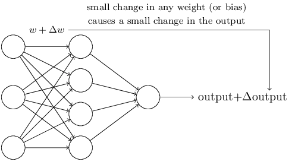
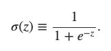
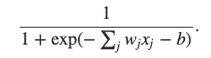
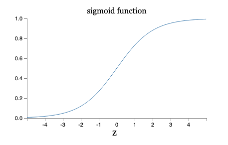
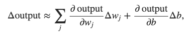

# Using Neural nets to recognize handwritten digits

## Perceptrons

### - What is a neural network?
- A type of artificial neuron called a perceptron.

### - How do perceptrons work?
  - A perceptron takes several binary inputs, x1, x2, ..., and produce 
a **single** binary output.
  - Introduce weights, w1, w2, ..., real numbers expressing the importance 
of the respective inputs to the output.
  - The neuron's output, **0 or 1**, is determined by whether the weighted sum ∑jwjxj 
is less than or greater than some threshold value.
  - In this network, first layer of perceptrons is making three simple decisions, by weighing the input evidence.
Each of the perceptrons from second layer is making a decision by weighing up the results  from the first layer. In this way
the second layer can make a complex and abstract decision. More complex decisions can be made by the third layer.
  - Two changes for simplify the description:
    - write ∑jwjxj as a dot product: **w⋅x**, where w and x are *vectors* 
    - move threshold to the other side of the inequality and replace it by *bias*: **b**
    - 
    - Bias is like a measure of how easy it is to get the perceptron to output a 1

## Sigmoid neurons

### - How can we devise algorithms for a neural network?
- **Suppose we have a network of perceptrons that we'd like to use to learn to solve some problem**
- The inputs to the network might be the raw pixel data from a scanned, handwritten image of a digit
- We'd like the network to learn **weights and biases** so that the output from the network correctly classifies the digit

- Problem: A small change in the weights or bias of any single perceptron in the network can sometimes 
cause the output of that perceptron to **completely flip**, say from 0 to 1. And the flip may then cause the behaviour of **the rest of the 
network to completely change** is some very complicated way.

### - Then we have sigmoid neurons
- Similar to perceptrons, but modified so that *small changes in weights and bias cause only a small change* in their output
- Output is not 1 or 0, but σ(w⋅x+b) , where σ is called the sigmoid function* and is defined by:

- To be more explicitly, the output is
- Suppose **z ≡ w⋅x+b**  is a large positive number. Then e−z≈0  and so σ(z)≈1.
- Shape of the sigmoid function:
- The smoothness of σ means that small changes Δwj in the weights and Δb in the bias will produce a small change Δoutput in the output from the neuron. In fact, calculus tells us that Δoutput is well approximated by
