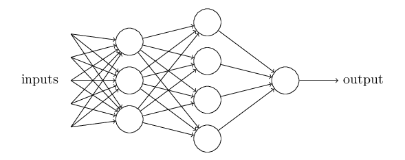
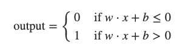

# Using Neural nets to recognize handwritten digits

## Perceptrons

### - What is a neural network?
- A type of artificial neuron called a perceptron.

### - How do perceptrons work?
  - A perceptron takes several binary inputs, x1, x2, ..., and produce 
a **single** binary output.
  - Introduce weights, w1, w2, ..., real numbers expressing the importance 
of the respective inputs to the output.
  - The neuron's output, **0 or 1**, is determined by whether the weighted sum ∑jwjxj 
is less than or greater than some threshold value.
  - In this network, first layer of perceptrons is making three simple decisions, by weighing the input evidence.
Each of the perceptrons from second layer is making a decision by weighing up the results  from the first layer. In this way
the second layer can make a complex and abstract decision. More complex decisions can be made by the third layer.
  - Two changes for simplify the description:
    - write ∑jwjxj as a dot product: **w⋅x**, where w and x are *vectors* 
    - move threshold to the other side of the inequality and replace it by *bias*: **b**
    - 
    - Bias is like a measure of how easy it is to get the perceptron to output a 1

## Sigmoid neurons